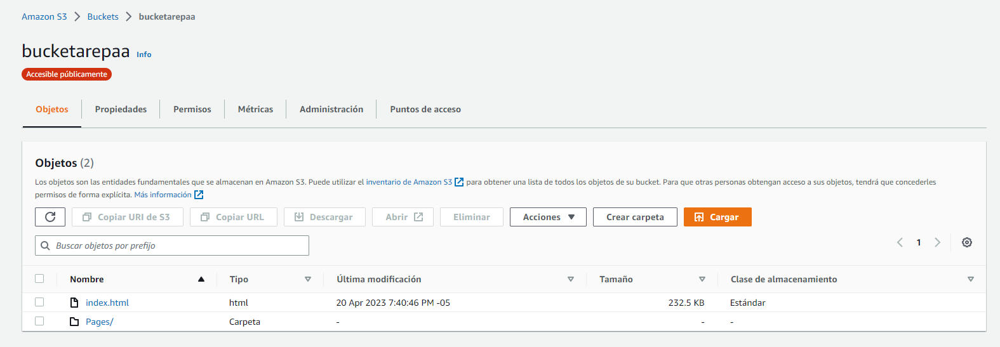

# AREP-TWITTER

## Escuela Colombiana de Ingeniería

## Autores

Andres Felipe Martinez

Juan Pablo Fonseca

Santiago Cardenas 


### Prerrequisitos

Para hacer uso de esta aplicación debe tener conocimientos de:
+ Java - Lenguaje de programación orientado a objetos.
+ Quarkus - Ejecución eficiente de aplicaciones Java en contenedores Kubernetes.
+ JWT - Decodificación, verificación y generación de JSON Web Tokens.
+ Maven - Herramienta para automatizar la gestión y construcción de proyectos Java. 
+ AWS - Plataforma de computación en la nube.

## Descripción del proyecto

El proyecto está diseñado como se ve en la imagen de abajo donde un browser hace peticiones a un API gateway el cual es el encargado de realizar un GET de los últimos 10 tweets y dos POST, uno para crear un tweet y otro para el login del usuario.


### Instancias AWS

1. Instalar Java, en este caso Java 11 con el siguiente comando:

```
sudo yum install java-11-amazon-corretto-devel

java -version
```

2. A través de una conexión sftp, subir el proyecto con los archivos de mvn y la configuración del proyecto en el archivo application.properties.

3. Instalar Quarkus ejecutando los siguientes comandos:

```
curl -Ls https://sh.jbang.dev/ | bash -s - trust add https://repo1.maven.org/maven2/io/quarkus/quarkus-cli/

curl -Ls https://sh.jbang.dev/ | bash -s - app install --fresh --force quarkus@quarkusio
```

4. Reiniciar la instancia.

5. Ubicarse en el directorio del proyecto y ejecutar el siguiente comando:

```
chmod +x /home/ec2-user/AREP-TWITTER/mvnw
```

6. Finalmente, ejecutar el proyecto con el siguiente comando:

```
quarkus dev
```

No olvidar abrir los puertos necesarios para que el proyecto pueda ser ejecutado correctamente.

### Bucket S3

Una vez se tengan los clientes JS, se deberá crear un bucket S3 en donde se subirán los archivos html y js.



Este servicio deberá correr por el protocolo https para que pueda ser utilizado en Cognito.

### AWS Cognito

Para hacer uso del servicio de Amazon cognito, se debe crear un grupo de usuarios donde:

1. Configurar la experiencia de inicio de sesión.

    Establecer como opciones de inicio de sesión el nombre de usuario y el correo electrónico.

2. Configurar los requisitos de seguridad.

    Seleccionar Valores predeterminados de Cognito y en la Autenticación multifactor, seleccionar sin MFA.

3. Configurar la experiencia de registro.

    Elegir la configuración que trae por defecto.

4. Configurar el envío de mensajes.

    Seleccionar la opción de enviar un correo electrónico con Cognito


5. Integración de la aplicación.

    Proporcionar un nombre al grupo de usuarios.


